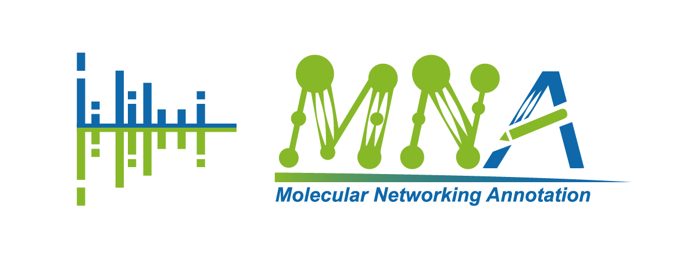

# Molecualr Networking Annotation (MNA)
This repository contains the original source code of MNA


# Installation
## Requirements
MNA can only run on unix systems for now.
It requires Python version 3.8+ and dependency packages can be installed with pip or conda.

`pip install -r requirements.txt` 
or
`conda create  -n MNA -f MNA.yml`

Remote tracking branches of the MNA repository can be cloned to a local folder using `git clone`.
[The compressed file of the MNA library](https://drive.google.com/file/d/1w6HF3w1KIJlTz_QaVqqtN1BzkGDhDgzw/view?usp=sharing)
should be downloaded and unzipped into the cloned folder.
# Quickstart
Before applying MNA, raw mass spectrometry (MS) data should be converted using [MSconvert](https://mzmine.github.io/mzmine_documentation/data_conversion.html). 
It is recommended to use [MZmine-based untargeted LC-MS workflow](https://mzmine.github.io/mzmine_documentation/workflows/lcmsworkflow/lcms-workflow.html) 
to generate the `quant.csv` and `mgf` files as inputs. 

Using `-h` for help messages and there are two subcommands in MNA: 

`main` for Default analysis workflow of MNA.

`mn` for quick re-analysis of the results generated by `main` command.

Here we briefly introduce the command of MNA quick start:

`python MNA.py main -q /example/example_quant.csv -m example.mgf`

# 
MNA was carefully tested, bugs may appear. 
Don't hesitate to contact us if you find any, or even better, send a pull request or open an issue. 
For other inquiries, please send an email to 2112007282@zjut.edu.cn and we will be happy to answer you 😄.


---


# More details (Gavin's note)

## 1. Install

### 1.1 Env

```bash
conda create -n MNA python=3.8
conda activate MNA
pip install -r requirements_gavin.txt
cp MNA ~/miniconda3/envs/MNA/bin
cp -r my_packages ~/miniconda3/envs/MNA/lib/python3.8/site-packages/
```


### 1.2 Database

It is recommended that place the MNA database in `$HOME/.msdb`

```bash
$ tree $HOME/.msdb

/Users/MS/.msdb
├── edbMS1.csv
├── edb_info.json
├── isdbMS1.csv
└── isdb_info.json
```

You can download one released version (2024) of the database here:

- https://pan.baidu.com/s/1bFol3sBsOnDfY5fxHp9b8g?pwd=zc2c (edbMS1: 587904; isdbMS1: 468363)


## 2. Example usage

- help info

```bash
MNA -h
```

- common commands

```bash
cd /path/to/workdirectory
MNA main -q MZmine_Features_iimn_gnps_quant.csv -m MZmine_Features_iimn_gnps.mgf -o .
```


## 3. Visualization

You can import `visualization/MNA-style.xml` from Cytoscape as a style.

Click in sequence: **Open Cytoscape > File > Import > Styles from file...**


## 4. Other Details

### 4.1 subcommands

`main`: default analysis workflow of MNA
`mn`: re-analysis of results of default MNA workflow


### 4.2 Data source

- GNPS : 587904 experimental tandem mass

- COCONUT : 406919 natural products

- NPatls : 32553 microbial natural products

- CMNPD : 31560 marine natural products

- In silico tandem mass database : In silico tandem mass predicted from 471032 unique structures using CFM-ID 4.0


### 4.3 Tandem mass similarity algorithmn

- "modified_cosine_similarity" : Similarity used in GNPS

- "netural_loss" : Neutral loss mass spectral data enhances molecular similarity analysis

- "entropy": Entropy distance

- "unweighted_entropy": Unweighted entropy distance

- "euclidean": Euclidean distance

- "manhattan": Manhattan distance

- "chebyshev": Chebyshev distance

- "squared_euclidean": Squared Euclidean distance

- "fidelity": Fidelity distance

- "matusita": Matusita distance

- "squared_chord": Squared-chord distance

- "bhattacharya_1": Bhattacharya 1 distance

- "bhattacharya_2": Bhattacharya 2 distance

- "harmonic_mean": Harmonic mean distance

- "probabilistic_symmetric_chi_squared": Probabilistic symmetric χ2 distance

- "ruzicka": Ruzicka distance

- "roberts": Roberts distance

- "intersection": Intersection distance

- "motyka": Motyka distance

- "canberra": Canberra distance

- "baroni_urbani_buser": Baroni-Urbani-Buser distance

- "penrose_size": Penrose size distance

- "mean_character": Mean character distance

- "lorentzian": Lorentzian distance

- "penrose_shape": Penrose shape distance

- "clark": Clark distance

- "hellinger": Hellinger distance

- "whittaker_index_of_association": Whittaker index of association distance

- "symmetric_chi_squared": Symmetric χ2 distance

- "pearson_correlation": Pearson/Spearman Correlation Coefficient

- "improved_similarity": Improved Similarity

- "absolute_value": Absolute Value Distance

- "dot_product": Dot-Product (cosine)

- "dot_product_reverse": Reverse dot-Product (cosine)

- "spectral_contrast_angle": Spectral Contrast Angle

- "wave_hedges": Wave Hedges distance

- "cosine": Cosine distance

- "jaccard": Jaccard distance

- "dice": Dice distance

- "inner_product": Inner Product distance

- "divergence": Divergence distance

- "avg_l": Avg (L1, L∞) distance

- "vicis_symmetric_chi_squared_3": Vicis-Symmetric χ2 3 distance

- "ms_for_id_v1": MSforID distance version 1

- "ms_for_id": MSforID distance

- "weighted_dot_product": Weighted dot product distance


### 4.4 Interpretation of results

**Meaning of each level**

- A : MS1 unmatched

- B1 : MS1 match but exp MS2 match unwell
- B2 : MS1 match and exp MS2 match well
- C1 : MS1 match but in silico MS2 match unwell
- C2 : MS1 match and in silico MS2 match well


# Gavin's Custom scripts

## MNA2MirrorPlot

Used for plotting all MS/MS mirror comparison plots after MNA analysis.

```bash
# help info
python3 MNA2MirrorPlot.py -h

# common command
python3 MNA2MirrorPlot.py -i LZ_quant_result -m LZ.mgf -o output
```


## get_target_spectrum_from_mgf

Retrieve target spectrum from an MGF file based on ID.

```bash
# View help
python3 get_target_spectrum_from_mgf.py -h
```


## mirrorplot

Plot MS/MS mirror comparison based on two MGF files

```bash
# 查看帮助
python3 mirrorplot.py -h
```


## MNA1TargetMirrorPlot


